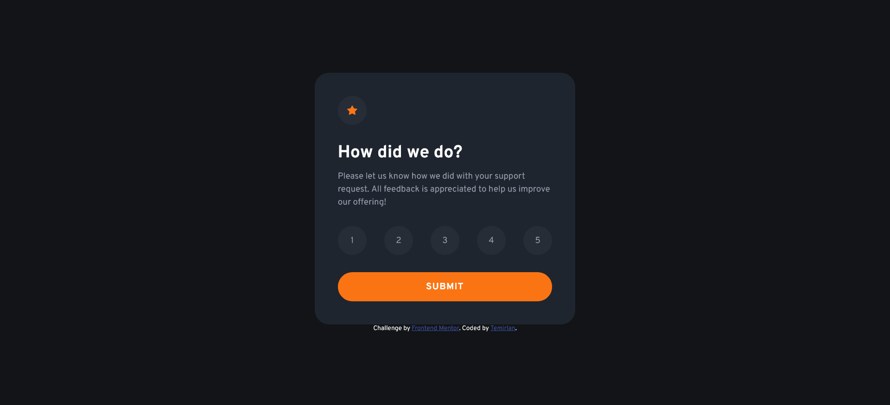
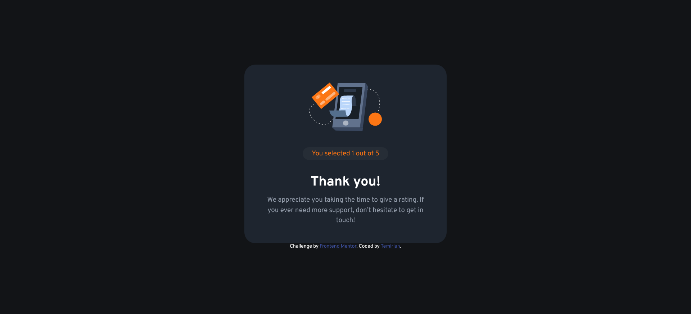

# Frontend Mentor - Interactive rating component solution

This is a solution to the [Interactive rating component challenge on Frontend Mentor](https://www.frontendmentor.io/challenges/interactive-rating-component-koxpeBUmI). Frontend Mentor challenges help you improve your coding skills by building realistic projects. 

## Table of contents

- [Overview](#overview)
  - [The challenge](#the-challenge)
  - [Screenshots](#screenshots)
  - [Links](#links)
- [My process](#my-process)
  - [Built with](#built-with)
  - [What I learned](#what-i-learned)
  - [Continued development](#continued-development)
  - [Useful resources](#useful-resources)
- [Author](#author)

**Note: Delete this note and update the table of contents based on what sections you keep.**

## Overview

### The challenge

Users should be able to:

- View the optimal layout for the app depending on their device's screen size
- See hover states for all interactive elements on the page
- Select and submit a number rating
- See the "Thank you" card state after submitting a rating

### Screenshots





### Links

- Solution URL: [Add solution URL here](https://github.com/TIKOsup/interactive-rating-component-main)
- Live Site URL: [Add live site URL here](https://tiko-intratingcomp-fementor.netlify.app)

## My process

### Built with

- Semantic HTML5 markup
- CSS custom properties
- Flexbox
- JavaScript

### What I learned

While working through this project I was practiced with HTML, CSS, and JavaScript. I repeated font importing, css variables creating, and learned some other css properties and selections which didn't know before. Also I first time worked with media queries. 

```css
@import url('https://fonts.googleapis.com/css2?family=Overpass:wght@400;700&display=swap');
```
```css
:root {
    --orange: hsl(25, 97%, 53%);
    --white: hsl(0, 0%, 100%);
    --light-grey: hsl(217, 12%, 63%);
}
```
```css
@media only screen and (max-width: 376px) {
    .container {
        margin: 25px;
    }
}
```

The main goal for this project for me was to learn CSS. Its properties, selections and others.

### Continued development

I want to continue focusing on HTML, CSS, and JavaScript.

### Useful resources

- [Example resource 1](https://www.freecodecamp.org/news/css-vertical-align-how-to-center-a-div-text-or-an-image-example-code/) - This helped me to vertically align a content.

## Author

- Frontend Mentor - [@TIKO](https://www.frontendmentor.io/profile/TIKOsup)